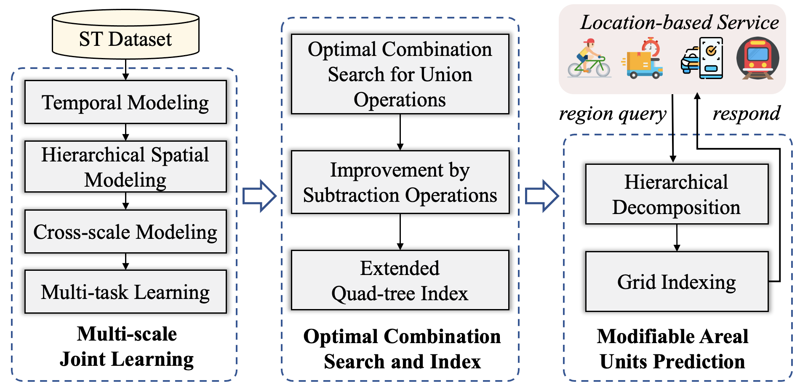

# One4All-ST
## Introduction
**One4All-ST** is a framework that can conduct spatio-temporal prediction for arbitrary modifiable units using only one model.

It contains three parts namely **Multi-scale Joint Learning**, **Optimal Combination Search and Index** and **Modifiable Areal Units Prediction**.


This repository includes necessary open-source code to reproduce the results in our paper.

## Installation
Our project based on the Open Source Spatio-Temporal Prediction Package **UCTB**. Thus we highly recommend you follow the tutorial [here](https://uctb.github.io/UCTB/md_file/installation.html#) to install essential dependencies of UCTB. What's more, to address our problem targeted at spatio-temporal prediction for modifiable units, we use extra library `geopandas` and `shapely` to read and manipulate geometries.

As a result, the full installation process is as follows.

```bash
# follow the specific situation in the tutorial above
conda env create -f environment.yaml
# install `geopandas`
pip install geopandas
# install `shapely`
pip install shapely
```

## Usage
The scripts in the root directory of our repository are organized according to the three components of the framework in which `exp.py` is the entrace file for model defining, training and saving results, `regular.py` is the script responsible for rasterize arbitrary query into grids and `test_query.py` will includes how to obtain optimal combinations and show the final test results. Besides, we provide a script that contains the entire process execution named `Runner_for_full_scripts.py`

```bash
# obtain raterized query (more options can be refered to the regular.py)
python regular.py
# obtain unified model (more options can be refered to the exp.py)
python exp.py
# obtain optimal combinations and test results (more options can be refered to the test_query.py)
python test_query.py
```
